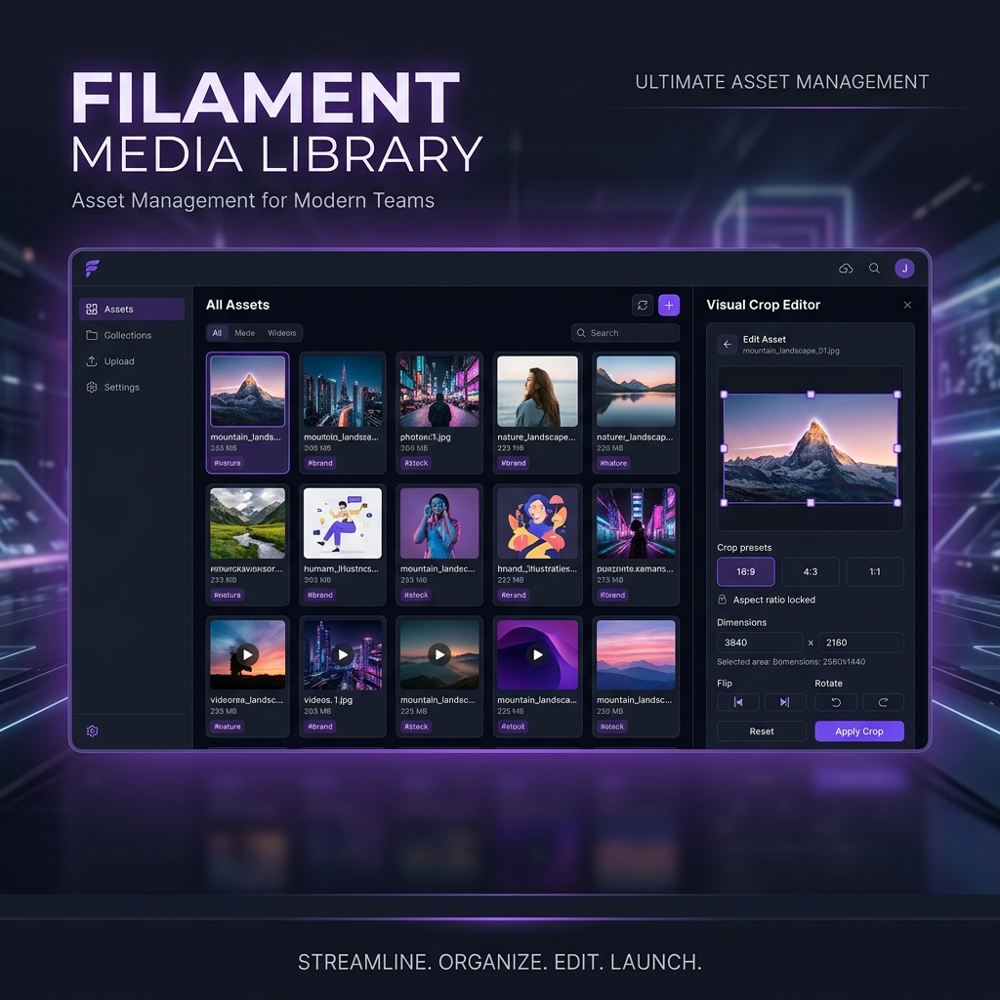

# Filament Media Library



[](https://packagist.org/packages/tsrgtm/filament-media-library)
[](LICENSE)
[](#testing)

A premium, production-ready Filament-native media library plugin for Laravel. It provides polymorphic media attachments, background optimizations, responsive HTML layout generators, secure URL streaming, deduplication, in-page split-view visual media editing, and a WordPress-style media picker modal.

📖 **Interactive Documentation Portal:** [https://tsrgtm.github.io/Filament-Media-Library/](https://tsrgtm.github.io/Filament-Media-Library/)

---

## Features

- **Polymorphic Attachments:** Attach single or multiple files to any Eloquent model using a simple `HasMedia` trait.
- **Intervention Image v3 Optimizations:** Automatically compresses, scales, and creates auto-negotiated WebP fallbacks for uploaded images.
- **Video Upload & Processing:** Upload videos up to 500MB. Auto-generate thumbnail frames via `php-ffmpeg`. Trim video clips by start/end time directly in the UI.
- **Persistent Split-View Visual Editor:**
  - 🖼️ **Visual Image Cropper** – crop visually using Cropper.js inside the right-hand panel.
  - 🎞️ **Video Trim Slider** – trim video clips visually using a range slider timeline.
  - ⚡ **SVG Live Code Editor** – edit raw SVG code and see the visual render update live.
  - 📝 **DOCX Find & Replace** – mock page view and search-and-replace text inside Word documents.
  - 📄 **PDF Metadata Editor & Viewer** – inline PDF iframe preview along with form to edit PDF attributes.
  - 🗒️ **Code Text Editor** – edit plain-text files (`.txt`, `.csv`, `.json`, `.md`, `.css`, `.js`, etc.) in a monospaced code container.
- **File Replacement:** Replace the physical file of any media item without breaking its URL.
- **High-Fidelity Lightbox Previews:** Fullscreen viewer with navigation arrows, keyboard control (←/→/Esc), and auto-detection of media type:
  - 📸 Image zoom/scroll
  - 📽️ HTML5 Video player with controls
  - 🎵 Audio player
  - 📄 PDF inline iframe viewer
  - 📁 Download fallback for other documents
- **Right-Click Context Menu:** Access all actions instantly by right-clicking any media card.
- **WordPress-style Media Details:** Visual slide-over details panel to preview files and edit alt text and titles inline.
- **WordPress-style Media Picker:** Select, search, filter, and reuse existing uploaded files in form views instead of creating duplicate uploads.
- **On-Demand Format Conversion:** Dynamically convert file formats (JPEG, PNG, WebP), compression quality (10–100), and max dimensions directly from the Filament resource table.
- **SEO-Stable Paths:** Serves assets via static, predictable URLs (`/media-serve/{media_id}/{filename}`) preventing broken images.
- **Secure File Support:** Automatically generates signed URLs valid for 1 hour for secure private disks.
- **Smart Deduplication:** Performs SHA-256 integrity checks on uploads to link identical files to the same physical disk location, saving storage space.
- **Background Processing:** Process image resizing and optimization asynchronously via Laravel Queues.
- **Dark Mode & Custom CSS:** Full dark mode support using CSS variables. All classes are prefixed `fml-` and documented for customization.
- **Dismissible First-Time Guide:** An onboarding guide card surfaces on first visit and can be permanently dismissed per browser with localStorage.

---

## Requirements

- PHP ≥ 8.1
- Laravel ≥ 10.x
- Filament v3 / v4 / v5
- `intervention/image` v3 (GD driver)
- `ffmpeg` binary on `$PATH` for video thumbnail generation (optional but recommended)

---

## Installation

1. Install the package via Composer:
   ```bash
   composer require tsrgtm/filament-media-library
   ```

2. Publish configuration and database migrations:
   ```bash
   php artisan vendor:publish --provider="Tsrgtm\FilamentMediaLibrary\MediaLibraryServiceProvider"
   ```

3. Run migrations:
   ```bash
   php artisan migrate
   ```

4. Register the plugin in your Filament Panel Provider (e.g., `app/Providers/Filament/AdminPanelProvider.php`):
   ```php
   use Tsrgtm\FilamentMediaLibrary\Filament\MediaLibraryPlugin;

   public function panel(Panel $panel): Panel
   {
       return $panel
           // ...
           ->plugins([
               MediaLibraryPlugin::make(),
           ]);
   }
   ```

### Video Support (FFMpeg)

For thumbnail generation and video trimming install `php-ffmpeg` and set the binary paths in `config/media-library.php`:

```bash
composer require php-ffmpeg/php-ffmpeg
```

```php
// config/media-library.php
'ffmpeg' => [
    'ffmpeg_binary'  => env('FFMPEG_BINARY', '/usr/bin/ffmpeg'),
    'ffprobe_binary' => env('FFPROBE_BINARY', '/usr/bin/ffprobe'),
    'timeout'        => 3600,
],
```

### Plugin Customization Options

```php
MediaLibraryPlugin::make()
    // Media Library Resource customization:
    ->icon('heroicon-o-photo')        // Alias for navigationIcon()
    ->label('Library')                // Alias for navigationLabel()
    ->navigationGroup('Content')
    ->navigationSort(1)
    ->slug('media-library')

    // Settings Customization:
    ->showSettings(true)              // Set to false to hide the settings header action modal
```

---

## Setup Models

Add the `HasMedia` trait to your Eloquent models and define your attachments collections inside the `mediaCollections` method:

```php
namespace App\Models;

use Illuminate\Database\Eloquent\Model;
use Tsrgtm\FilamentMediaLibrary\Traits\HasMedia;

class Post extends Model
{
    use HasMedia;

    public function mediaCollections(): array
    {
        return [
            'featured_image' => [
                'single'      => true, // Replaces previous attachment automatically
                'conversions' => ['thumb', 'medium'],
                'fallback'    => '/images/default-thumbnail.png',
            ],
            'gallery' => [
                'multiple' => true,
            ],
        ];
    }
}
```

### Fluent Upload API

```php
// From a request upload
$post->addMedia($request->file('cover'))
    ->withAltText('Featured blog banner')
    ->toCollection('featured_image');

// From local path
$post->addMedia(storage_path('exports/invoice.pdf'))
    ->preservingOriginal()
    ->toCollection('attachments');
```

---

## Filament Form Inputs

### 1. File Upload Component (`MediaLibraryUpload`)

```php
use Tsrgtm\FilamentMediaLibrary\Filament\Components\MediaLibraryUpload;

public static function form(Form $form): Form
{
    return $form
        ->schema([
            MediaLibraryUpload::make('featured_image')
                ->label('Cover Photo')
                ->collection('featured_image')
                ->image()
                ->maxSize(2048), // KB
        ]);
}
```

### 2. Media Picker Component (`MediaLibraryPicker`)

```php
use Tsrgtm\FilamentMediaLibrary\Filament\Components\MediaLibraryPicker;

public static function form(Form $form): Form
{
    return $form
        ->schema([
            MediaLibraryPicker::make('featured_image')
                ->label('Featured Image')
                ->collection('featured_image'),

            MediaLibraryPicker::make('gallery')
                ->label('Gallery Images')
                ->collection('gallery')
                ->multiple(), // Supports multi-selection
        ]);
}
```

---

## Media Library UI – New Features

### Right-Hand Split-View Visual Editor

Single-clicking any card opens the persistent right-hand **Visual Preview & Editor Panel** inline. This panel houses dedicated editing features tailored for each file type:

- **🖼️ Image Crop** – Visually crop files using an interactive selection box (Cropper.js) directly inside the editor pane.
- **↔️ Image Resize / Convert** – Re-scale images to a maximum boundary and convert dynamically to JPEG, PNG, or WebP.
- **✂️ Video Trim** – Drag timeline sliders to define start and end trim boundaries for the video.
- **⚡ SVG Live Code Editor** – Raw SVG XML text area editor on one tab and a live-updated visual preview container on another.
- **📝 DOCX Find & Replace** – Extract and display DOCX text as a mock document page, offering an inline Find & Replace form.
- **📄 PDF Viewer & Editor** – Embeds the PDF file in an iframe alongside forms to edit its metadata.
- **🗒️ Text File Editor** – Full monospaced editor inside the side panel to edit text documents (`.txt`, `.csv`, `.json`, etc.).
- **✏️ Edit Metadata** – Customize the asset's Title and Alt Text directly.
- **🗑️ Delete** – Soft-delete items to the trash folder.

### Lightbox Preview

Click any media card thumbnail to open the fullscreen lightbox:

- Navigate with **← →** arrow keys or on-screen buttons
- Press **Esc** to close
- Automatically renders the appropriate viewer by file type

### Video Upload

Upload videos up to **500MB** with the standard Upload dialog. Videos with an `mp4`, `webm`, or `ogg` MIME type will:

- Show an auto-generated thumbnail (requires FFMpeg)
- Preview inline in the lightbox using the native HTML5 `<video>` player
- Support trimming via the **Trim Video** action

---

## Blade Templating & Responsive Images

```blade
{!! $post->getFirstMedia('featured_image')->img('medium', ['class' => 'rounded-xl border shadow-sm']) !!}
```

Compiles to:
```html

```

---

## CSS Customization

The plugin ships a standalone CSS file (`resources/css/media-library.css`) that is auto-registered. All classes use the `fml-` prefix and CSS variables for theming. Dark mode is handled automatically.

| Class | Description |
|---|---|
| `.fml-media-box` | Root grid layout for the media page |
| `.fml-sidebar` | Left navigation sidebar |
| `.fml-card` | Individual media item card |
| `.fml-card-preview` | Thumbnail/icon preview area within a card |
| `.fml-card-footer` | Title and metadata row below the preview |
| `.fml-context-menu` | Right-click context menu overlay |
| `.fml-lightbox` | Fullscreen media viewer modal |
| `.fml-guide-card` | Onboarding guide banner (first-time users) |

Override CSS variables in your app's stylesheet:
```css
:root {
    --fml-primary: 99, 102, 241; /* custom indigo */
}
```

---

## Testing

```bash
vendor/bin/phpunit
```

---

## License

This package is open-sourced software licensed under the [MIT License](LICENSE).
